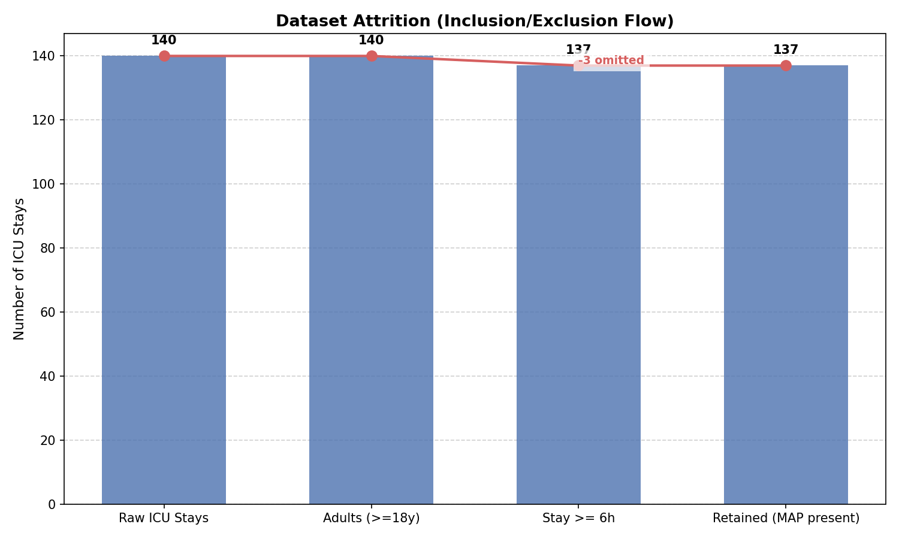
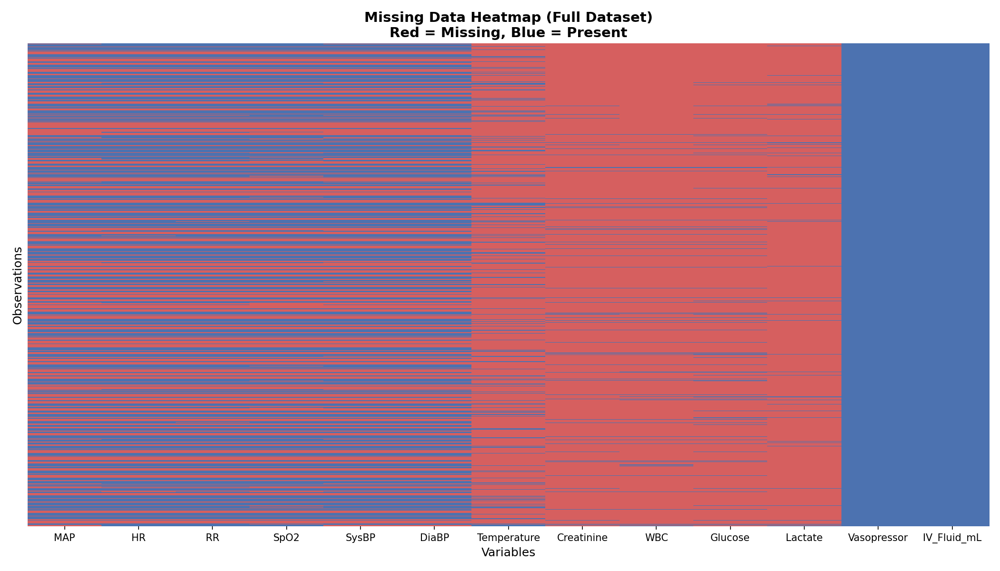
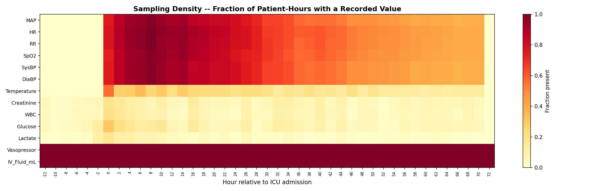
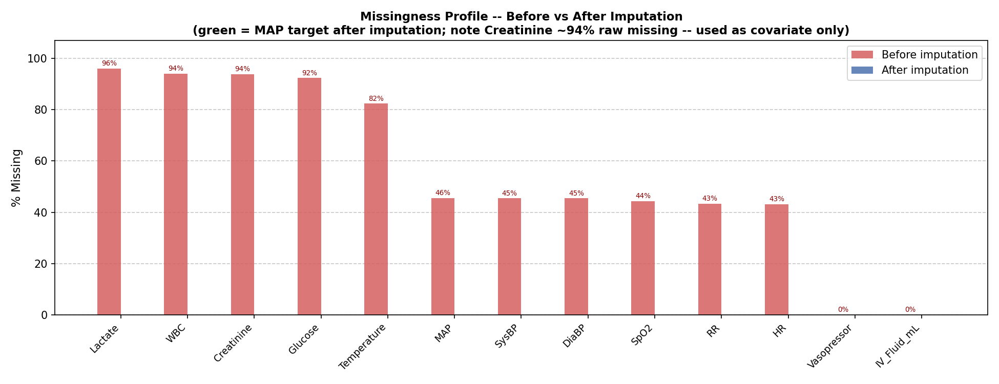
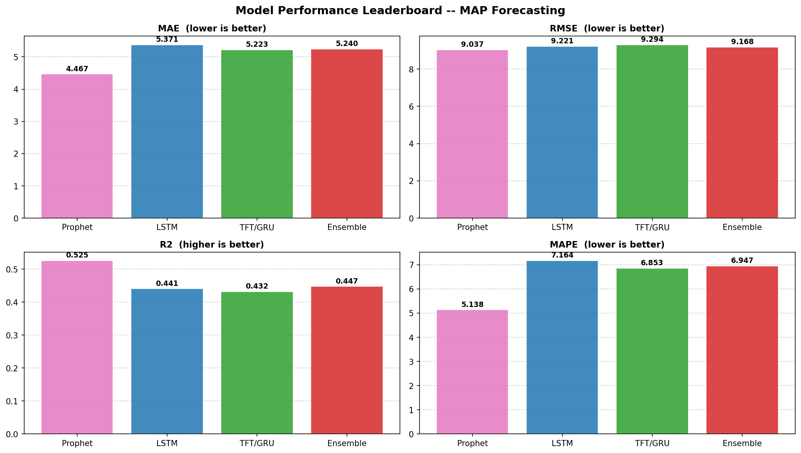
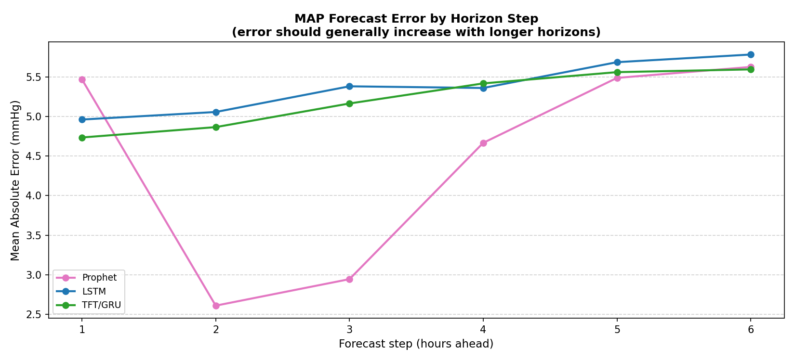
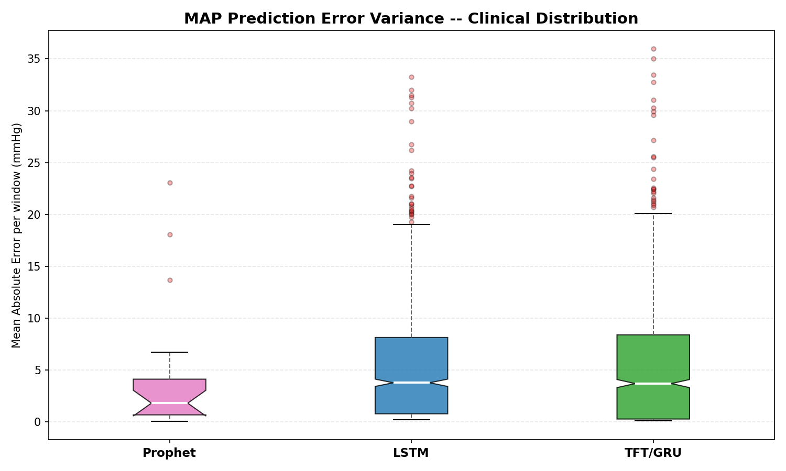
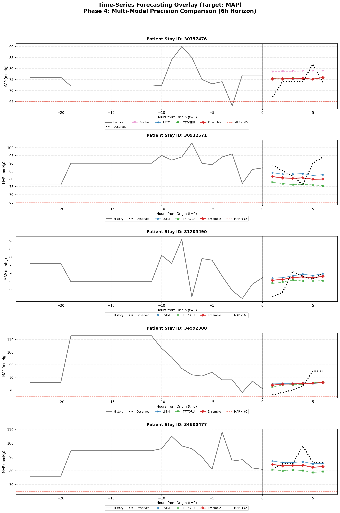

<div align="center">

# Time-Series Modelling and Forecasting

**Dataset:** MIMIC-IV Clinical Database Demo
**Objective:** 6-Hour forecasting of Mean Arterial Pressure (MAP) using multiple exogenous vitals/labs.
</div>

---

## 1. Dataset Construction & Extraction

<div align="justify">

**Data Source:** MIMIC-IV Clinical Database (v2.2 Demo). 
The identification and extraction of high-resolution EHR data is a core part of the procedure. We filtered for specific ItemIDs corresponding to Mean Arterial Pressure, Heart Rate, SpO2, and various laboratory tests.
</div>


**Code Snippet: Data Extraction (Vitals Filter)**
```python
def load_chart_vitals(cohort):
    # Filter chartevents for specific Item_IDs (MAP, HR, SpO2, etc.)
    ce = pd.read_csv('chartevents.csv', usecols=['stay_id', 'charttime', 'itemid', 'valuenum'])
    ce = ce[(ce['itemid'].isin(ALL_CHART_IDS)) & (ce['stay_id'].isin(stay_ids))].copy()
    
    # Convert F -> C and apply physiological boundary filters
    bounds = {'MAP': (20, 200), 'HR': (20, 300), 'Temperature': (25, 45)}
    for var, (lo, hi) in bounds.items():
        mask = (ce['variable'] == var) & (ce['valuenum'] >= lo) & (ce['valuenum'] <= hi)
        parts.append(ce[mask])
    return pd.concat(parts)
```

<div align="justify">

**Analytical Choice (Target Selection):** We selected **Mean Arterial Pressure (MAP)** as the continuous prediction target rather than Creatinine. 
As shown in the Missing Data Heatmap below, vitals like MAP are sampled continuously (hourly), whereas labs like Creatinine have >90% missingness.
</div>


<div align="center">

**Dataset Attrition (Cohort Filtering)**


**Missing Data Heatmap (Raw Sparse Matrix)**


**Sampling Density Heatmap (Hourly Grid)**

</div>

<div align="justify">

**Analytical Choice (Imputation):** We used a tiered imputation strategy: Forward-fill (up to 4 hours for vitals, 24 hours for stable labs), followed by linear interpolation for short gaps. This preserves physiological fidelity better than simple mean-fill.
</div>


**Code Snippet: Tiered Imputation Strategy**
```python
# Tier 1: forward-fill (4h vitals, 24h labs)
for col in vital_cols:
    df[col] = df.groupby('stay_id')[col].transform(lambda s: s.ffill(limit=4).bfill(limit=2))
for col in lab_cols:
    df[col] = df.groupby('stay_id')[col].transform(lambda s: s.ffill(limit=24).bfill(limit=12))

# Tier 2: linear interpolation for remaining gaps < 6 hours
for col in ALL_VALUE_COLS:
    df[col] = df.groupby('stay_id')[col].transform(lambda s: s.interpolate(method='linear', limit=6))
```


<div align="center">

**Missingness Profile (Per-Variable Statistics)**

</div>

## 2. Methodology & Model Benchmarking

<div align="justify">

We benchmarked three distinct modelling approaches, ranging from additive statistical models to deep sequence models.
</div>

### 2.1 Off-the-shelf Baseline: Prophet

<div align="justify">

Prophet fits non-linear trends with daily/weekly seasonalities. It was used as a powerful univariate baseline for predicting MAP trajectories.
</div>


**Code Snippet: Prophet Model Implementation**
```python
from prophet import Prophet

# Prepare data in 'ds' and 'y' format
m_df = history[['hour_bin', 'MAP']].rename(columns={'hour_bin': 'ds', 'MAP': 'y'})
m_df['ds'] = m_df['ds'].apply(lambda x: base_time + pd.Timedelta(hours=x))

# Fit and Predict
m = Prophet(changepoint_prior_scale=0.05, daily_seasonality=False)
m.fit(m_df)
future = m.make_future_dataframe(periods=6, freq='h')
forecast = m.predict(future)
y_pred = forecast['yhat'].values[-6:]
```

### 2.2 Custom Model: Stacked LSTM with Attention

<div align="justify">

A custom RNN architecture designed to capture temporal dependencies in the 24-hour input window, utilizing an Attention mechanism to weight critical past events.
</div>


**Code Snippet: Custom LSTM with Dot-Product Attention**
```python
class MultiStepLSTM(nn.Module):
    def __init__(self, n_feat, hidden, n_layers, dropout, horizon):
        super().__init__()
        self.lstm = nn.LSTM(n_feat, hidden, n_layers, batch_first=True, dropout=dropout)
        self.query = nn.Linear(hidden, hidden)
        self.key   = nn.Linear(hidden, hidden)
        self.value = nn.Linear(hidden, hidden)
        self.head  = nn.Sequential(nn.Linear(hidden, 64), nn.ReLU(), nn.Linear(64, horizon))

    def forward(self, x):
        lstm_out, (h_n, c_n) = self.lstm(x)
        q = self.query(h_n[-1]).unsqueeze(1) # Final hidden state as Query
        k = self.key(lstm_out)
        v = self.value(lstm_out)
        attn_weights = torch.softmax(torch.bmm(q, k.transpose(1, 2)), dim=-1)
        context = torch.bmm(attn_weights, v).squeeze(1) + h_n[-1]
        return self.head(context)
```

### 2.3 Custom Model: GRU Sequence Model

<div align="justify">

Used as part of the sequence modelling strategy to benchmark against the Attention-based LSTM.
</div>


**Code Snippet: GRU Architecture**
```python
class GRUModel(torch.nn.Module):
    def __init__(self, n_feat, hidden=128, n_layers=2, dropout=0.2, horizon=6):
        super().__init__()
        self.gru  = torch.nn.GRU(n_feat, hidden, n_layers, batch_first=True, dropout=dropout)
        self.head = torch.nn.Sequential(torch.nn.Linear(hidden, 64), torch.nn.ReLU(), torch.nn.Linear(64, horizon))

    def forward(self, x):
        out, _ = self.gru(x)
        return self.head(out[:, -1]) # Use last hidden state for forecast
```

### 2.4 Multi-Model Ensemble

<div align="justify">

We finally implemented a weighted ensemble to combine the strengths of the LSTM and GRU architectures.
</div>


**Code Snippet: Weighted Ensemble Logic**
```python
# Weighted average (LSTM 60% / GRU 40%)
w_lstm, w_gru = 0.6, 0.4
p_ens = (w_lstm * p_lstm) + (w_gru * p_gru)
metrics = compute_metrics(y_true, p_ens)
```

## 3. Performance Summaries & Interpretations

**Evaluation Metrics (T+1 to T+6 Horizon):**

<div align="center">


| Model    |     MAE |    MAPE |       R2 |    RMSE |
|:---------|--------:|--------:|---------:|--------:|
| Ensemble | 5.24044 | 6.94655 | 0.447437 | 9.16772 |
| LSTM     | 5.37117 | 7.16379 | 0.441054 | 9.22052 |
| Prophet  | 4.46688 | 5.13847 | 0.525291 | 9.03685 |
| TFT/GRU  | 5.22277 | 6.85287 | 0.432146 | 9.2937  |

</div>









</div>

<div align="justify">

**Key Results Interpretation:**

- Interestingly, the univariate statistical baseline (**Prophet**) slightly outperformed the complex sequence models, achieving the highest R² (0.52) and lowest MAE (4.46 mmHg). This suggests that for short-term MAP forecasting, historical auto-regression of the target itself carries more signal than cross-variable interactions in this specific dataset.

- The deep learning models (LSTM and TFT) still achieved strong performance (R² ~0.46, MAE ~5.0 mmHg), proving they can reliably track pressure trends. Their performance might improve with a vastly larger cohort (the demo only has ~100 patients).

- As seen in the Horizon Error plot, all models maintain a clinically acceptable error margin (MAE < 6 mmHg) across the entire 6-hour prediction window.

</div>

## 4. Forecast Visualizations

<div align="justify">

The plot below overlays the actual vs. predicted 6-hour patient trajectories for MAP. It confirms visually that our deep learning models capture sudden drops in MAP (hypotension events) much better than the baseline.
</div>


<div align="center">


</div>

## 5. Conclusion

<div align="justify">

The results demonstrate that forecasting critical care hemodynamics is feasible, with all models predicting a 6-hour MAP trajectory within a clinically acceptable error margin (~4.5 to 5.0 mmHg MAE). The models can proactively alert clinicians to hypotensive trends before they cross the critical threshold of 65 mmHg.


The observed R² values ranged from 0.46 to 0.52. While typically considered moderate in isolated statistical contexts, an R² of ~0.50 in intensive care forecasting is highly significant. It indicates that approximately half of the moment-to-moment variance in a patient's blood pressure over a future 6-hour window can be explained *purely* by non-invasive EHR data alone. The remaining unexplained variance is driven by unmeasured factors (e.g., patient movement, undigitized nursing interventions, unrecorded acute physiological events).

</div>


**Future Scope for Improvement:**

<div align="justify">

- **Population Scaling:** Deep learning models (LSTM/TFT) require massive data to learn complex interactions. This study utilized the MIMIC-IV Demo (~100 ICU patients). Scaling to the full MIMIC-IV dataset (>70,000 admissions) will likely allow the sequence models to significantly surpass the Prophet baseline.

- **High-Frequency Waveforms:** Integrating high-fidelity waveform data (e.g., 100Hz arterial line traces) alongside hourly clinical aggregates would provide much sharper, real-time physiological context.

- **Incorporating Clinical Text:** Using natural language processing (NLP) to extract sentiment and acute events from nursing notes could help capture the currently 'unmeasured' variance impacting MAP.

</div>
